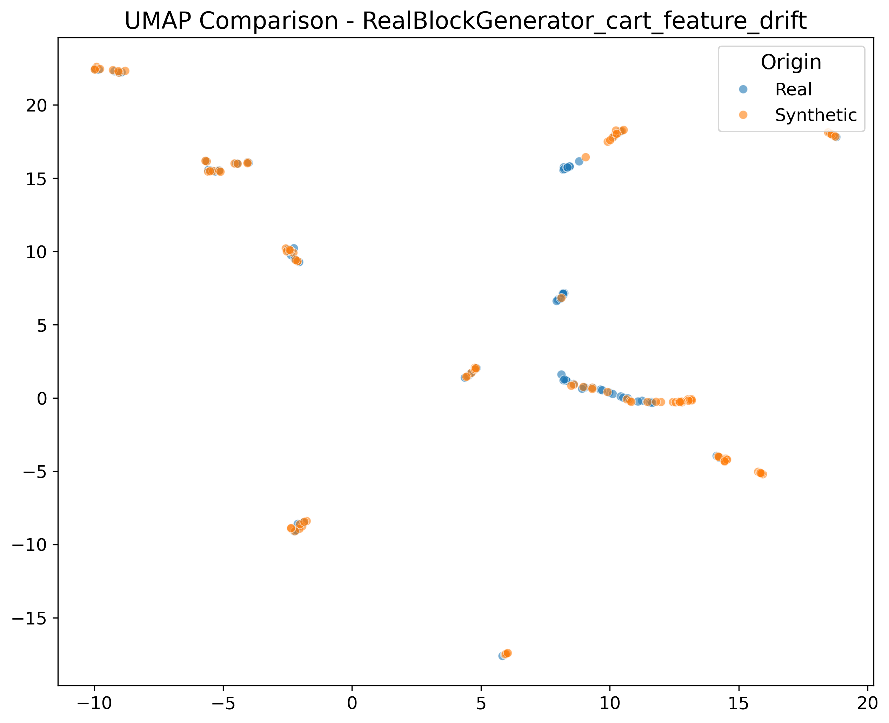

# Data Quality & Comparison Report

**Generator:** RealBlockGenerator_cart_feature_drift
**Date:** 2026-01-15T08:48:37.163480

## 📜 Drift Injection History
### Injection #1
- **Method:** inject_feature_drift
- **Type:** shift
- **Features:** Feature
- **Magnitude:** 2.0
- **Time:** 2026-01-14T09:36:57.046935

### Injection #2
- **Method:** inject_concept_drift_gradual
- **Type:** N/A
- **Time:** 2026-01-14T09:37:58.541930

### Injection #3
- **Method:** inject_feature_drift
- **Type:** scale
- **Features:** Val
- **Magnitude:** 2.0
- **Time:** 2026-01-14T09:39:04.858896

### Injection #4
- **Method:** inject_feature_drift
- **Type:** shift
- **Features:** Feature
- **Magnitude:** 2.0
- **Time:** 2026-01-14T09:53:31.877807

### Injection #5
- **Method:** inject_concept_drift_gradual
- **Type:** N/A
- **Time:** 2026-01-14T09:54:15.232063

### Injection #6
- **Method:** inject_feature_drift
- **Type:** scale
- **Features:** Val
- **Magnitude:** 2.0
- **Time:** 2026-01-14T09:55:12.842625

### Injection #7
- **Method:** inject_feature_drift
- **Type:** shift
- **Features:** Feature
- **Magnitude:** 2.0
- **Time:** 2026-01-14T09:59:26.241590

### Injection #8
- **Method:** inject_concept_drift_gradual
- **Type:** N/A
- **Time:** 2026-01-14T10:00:07.232848

### Injection #9
- **Method:** inject_feature_drift
- **Type:** scale
- **Features:** Val
- **Magnitude:** 2.0
- **Time:** 2026-01-14T10:00:35.923369

### Injection #10
- **Method:** inject_feature_drift
- **Type:** shift
- **Features:** Feature
- **Magnitude:** 2.0
- **Time:** 2026-01-14T10:08:38.309564

### Injection #11
- **Method:** inject_concept_drift_gradual
- **Type:** N/A
- **Time:** 2026-01-14T10:09:12.604747

### Injection #12
- **Method:** inject_feature_drift
- **Type:** scale
- **Features:** Val
- **Magnitude:** 2.0
- **Time:** 2026-01-14T10:09:39.175268

### Injection #13
- **Method:** inject_feature_drift
- **Type:** shift
- **Features:** Feature
- **Magnitude:** 2.0
- **Time:** 2026-01-14T10:17:48.488053

### Injection #14
- **Method:** inject_concept_drift_gradual
- **Type:** N/A
- **Time:** 2026-01-14T10:18:30.976768

### Injection #15
- **Method:** inject_feature_drift
- **Type:** scale
- **Features:** Val
- **Magnitude:** 2.0
- **Time:** 2026-01-14T10:19:36.011057

### Injection #16
- **Method:** inject_feature_drift
- **Type:** shift
- **Features:** Feature
- **Magnitude:** 2.0
- **Time:** 2026-01-14T10:25:11.847229

### Injection #17
- **Method:** inject_concept_drift_gradual
- **Type:** N/A
- **Time:** 2026-01-14T10:26:15.980735

### Injection #18
- **Method:** inject_feature_drift
- **Type:** scale
- **Features:** Val
- **Magnitude:** 2.0
- **Time:** 2026-01-14T10:26:37.675452

### Injection #19
- **Method:** inject_feature_drift
- **Type:** shift
- **Features:** Feature
- **Magnitude:** 2.0
- **Time:** 2026-01-14T10:27:49.427485

### Injection #20
- **Method:** inject_concept_drift_gradual
- **Type:** N/A
- **Time:** 2026-01-14T10:28:19.289132

### Injection #21
- **Method:** inject_feature_drift
- **Type:** scale
- **Features:** Val
- **Magnitude:** 2.0
- **Time:** 2026-01-14T10:28:37.239802

### Injection #22
- **Method:** inject_feature_drift
- **Type:** shift
- **Features:** Feature
- **Magnitude:** 2.0
- **Time:** 2026-01-14T10:45:01.428350

### Injection #23
- **Method:** inject_concept_drift_gradual
- **Type:** N/A
- **Time:** 2026-01-14T10:46:06.009805

### Injection #24
- **Method:** inject_feature_drift
- **Type:** scale
- **Features:** Val
- **Magnitude:** 2.0
- **Time:** 2026-01-14T10:46:47.104783

### Injection #25
- **Method:** inject_new_value
- **Type:** N/A
- **Time:** 2026-01-14T10:47:59.175347

### Injection #26
- **Method:** inject_feature_drift
- **Type:** shift
- **Features:** Feature
- **Magnitude:** 2.0
- **Time:** 2026-01-14T11:08:31.367074

### Injection #27
- **Method:** inject_concept_drift_gradual
- **Type:** N/A
- **Time:** 2026-01-14T11:09:21.227344

### Injection #28
- **Method:** inject_feature_drift
- **Type:** scale
- **Features:** Val
- **Magnitude:** 2.0
- **Time:** 2026-01-14T11:09:58.088434

### Injection #29
- **Method:** inject_new_value
- **Type:** N/A
- **Time:** 2026-01-14T11:10:18.158369

### Injection #30
- **Method:** inject_feature_drift
- **Type:** shift
- **Features:** Feature
- **Magnitude:** 2.0
- **Time:** 2026-01-14T11:51:17.817194

### Injection #31
- **Method:** inject_concept_drift_gradual
- **Type:** N/A
- **Time:** 2026-01-14T11:53:07.368404

### Injection #32
- **Method:** inject_feature_drift
- **Type:** scale
- **Features:** Val
- **Magnitude:** 2.0
- **Time:** 2026-01-14T11:56:40.993032

### Injection #33
- **Method:** inject_feature_drift
- **Type:** shift
- **Features:** Feature
- **Magnitude:** 2.0
- **Time:** 2026-01-14T15:58:08.203036

### Injection #34
- **Method:** inject_concept_drift_gradual
- **Type:** N/A
- **Time:** 2026-01-14T15:59:19.372530

### Injection #35
- **Method:** inject_feature_drift
- **Type:** scale
- **Features:** Val
- **Magnitude:** 2.0
- **Time:** 2026-01-14T15:59:54.790354

### Injection #36
- **Method:** inject_feature_drift
- **Type:** shift
- **Features:** Feature
- **Magnitude:** 2.0
- **Time:** 2026-01-15T08:46:35.169407

### Injection #37
- **Method:** inject_concept_drift_gradual
- **Type:** N/A
- **Time:** 2026-01-15T08:47:46.066522

### Injection #38
- **Method:** inject_feature_drift
- **Type:** scale
- **Features:** Val
- **Magnitude:** 2.0
- **Time:** 2026-01-15T08:48:37.161212

## ⭐ Quality Score
- **Overall Quality:** 0.9285124446720416
- **Weighted Score:** 0.3249793556352146

## 📊 Dataset Statistics
| Metric | Real | Synthetic |
| :--- | :--- | :--- |
| Rows | 100 | 100 |
| Columns | 3 | 3 |
| Duplicates | 30 | 30 |

## 📉 Distribution Comparison
| Column | Real Dist | Synthetic Dist | Match |
| :--- | :--- | :--- | :--- |
| Val | Mean: -0.00, Std: 1.02 | Mean: -0.00, Std: 2.53 | ❌ |

## 🖼️ Visualizations
### Dimensionality Reduction (UMAP/PCA)

