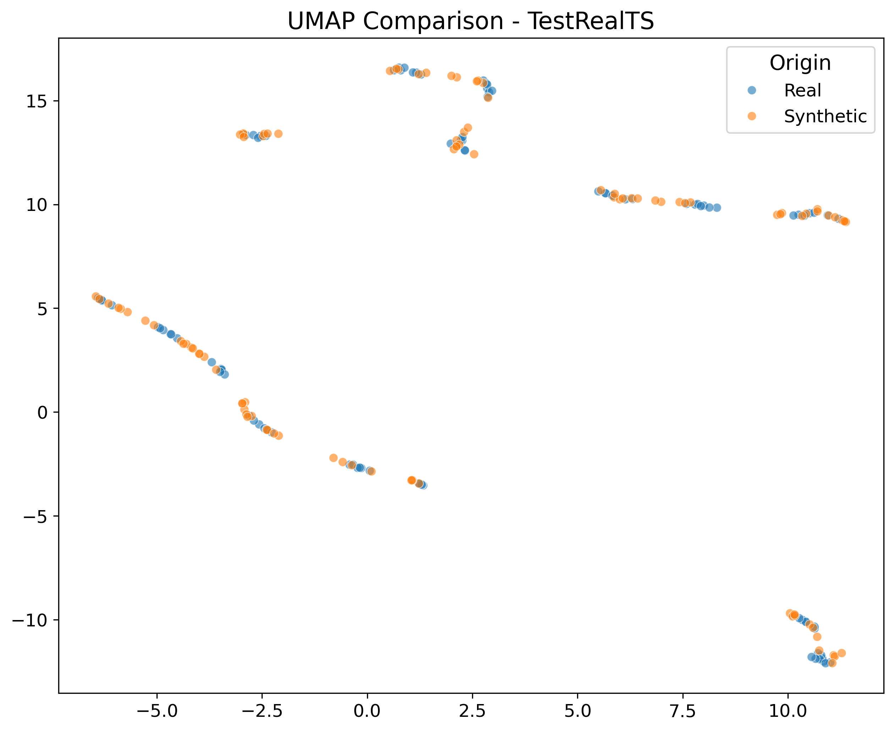

# Data Quality & Comparison Report

**Generator:** TestRealTS
**Date:** 2026-01-15T11:35:27.299660

## ⭐ Quality Score
- **Overall Quality:** 0.9792117558764736
- **Weighted Score:** 0.9792117558764736

## 📊 Dataset Statistics
| Metric | Real | Synthetic |
| :--- | :--- | :--- |
| Rows | 100 | 100 |
| Columns | 2 | 2 |
| Duplicates | 0 | 0 |

## 📉 Distribution Comparison
| Column | Real Dist | Synthetic Dist | Match |
| :--- | :--- | :--- | :--- |
| Value | Mean: 0.03, Std: 0.70 | Mean: 0.03, Std: 0.70 | ✅ |

## 🖼️ Visualizations
### Dimensionality Reduction (UMAP/PCA)

