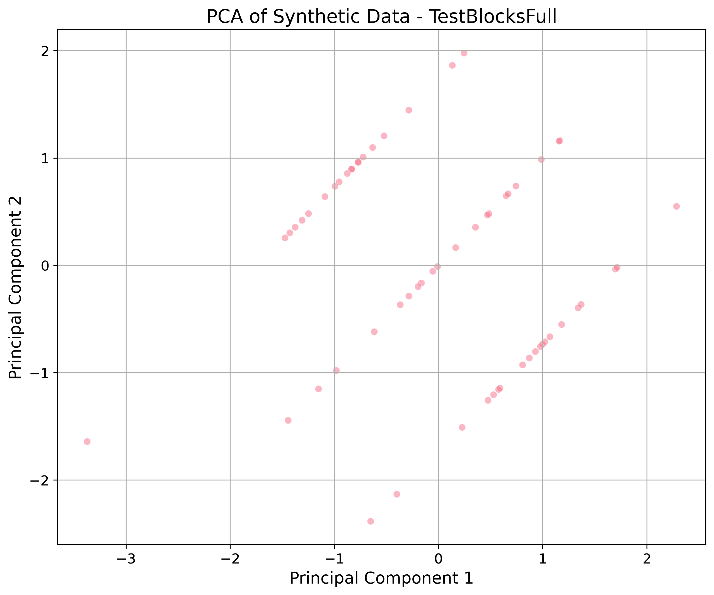

# Synthetic Data Quality Report

**Generator:** TestBlocksFull
**Date:** 2026-01-15T11:32:26.766004

## 📊 Dataset Information
- **Rows:** 60
- **Columns:** 2
- **Duplicates:** 0 (None %)

## ⭐ Quality Highlights
- **Null Values:** N/A
- **Exact Duplicates:** 0 (0.0%)

## 🔢 Numeric Statistics
| Column | Mean | Median | Mode | Std Dev | Distribution |
| :--- | :--- | :--- | :--- | :--- | :--- |
| block | 2.0000 | 2.0000 | 1.0 | 0.8234 | **Poisson (p=0.3292)** |
| Value | -0.0506 | -0.0105 | -3.3812585917188964 | 0.9472 | **norm (p=0.6877)** |

## 🖼️ Visualizations
### Dimensionality Reduction (PCA)

