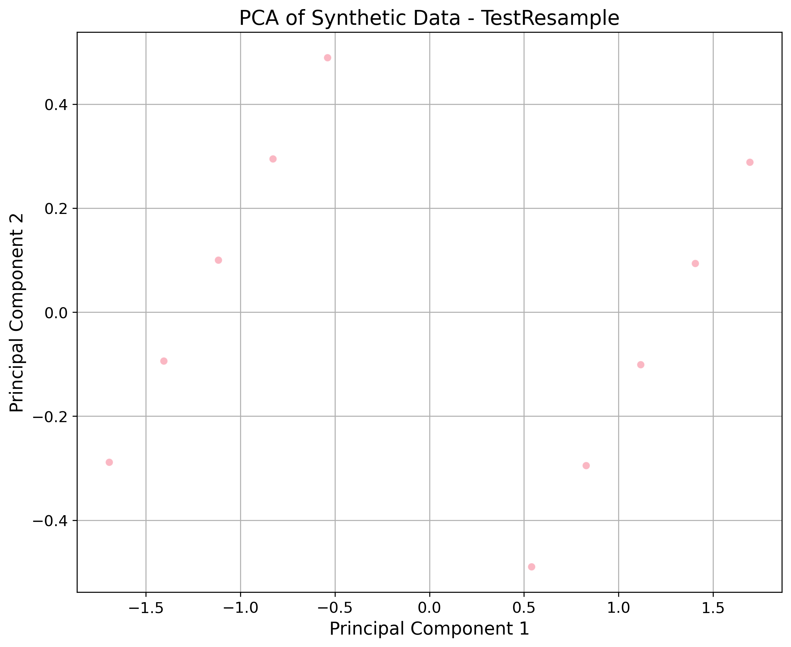

# Synthetic Data Quality Report

**Generator:** TestResample
**Date:** 2026-01-15T11:31:40.460464

## 📊 Dataset Information
- **Rows:** 30
- **Columns:** 3
- **Duplicates:** 0 (None %)

## ⭐ Quality Highlights
- **Null Values:** N/A
- **Exact Duplicates:** 0 (0.0%)

## 🔢 Numeric Statistics
| Column | Mean | Median | Mode | Std Dev | Distribution |
| :--- | :--- | :--- | :--- | :--- | :--- |
| Value | 14.5000 | 14.5000 | 0.0 | 8.8034 | **Unknown** |

## 🖼️ Visualizations
### Dimensionality Reduction (PCA)

