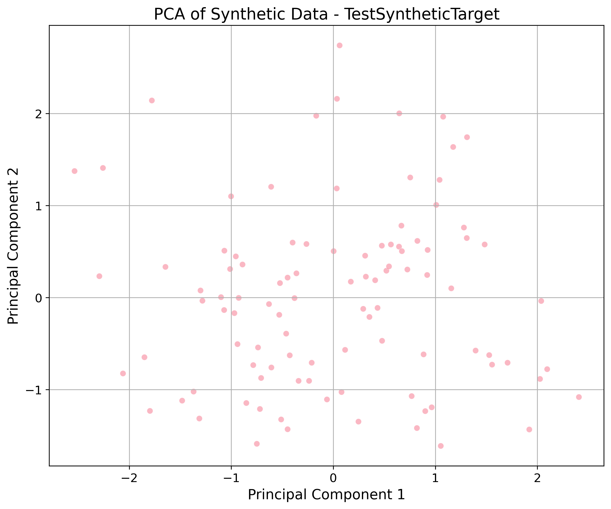

# Synthetic Data Quality Report

**Generator:** TestSyntheticTarget
**Date:** 2026-01-15T11:30:56.657198

## 📊 Dataset Information
- **Rows:** 100
- **Columns:** 3
- **Duplicates:** 0 (None %)

## ⭐ Quality Highlights
- **Null Values:** N/A
- **Exact Duplicates:** 0 (0.0%)

## 🔢 Numeric Statistics
| Column | Mean | Median | Mode | Std Dev | Distribution |
| :--- | :--- | :--- | :--- | :--- | :--- |
| Feature1 | -0.1010 | -0.1183 | -2.1634989677361895 | 0.9267 | **norm (p=0.9059)** |
| Feature2 | 5.0594 | 5.2479 | -0.8042780047492295 | 2.1015 | **norm (p=0.8275)** |
| Target | 0.5000 | 0.5000 | 0.0 | 0.5025 | **Bernoulli (p=1.0000)** |

## 🖼️ Visualizations
### Dimensionality Reduction (PCA)

