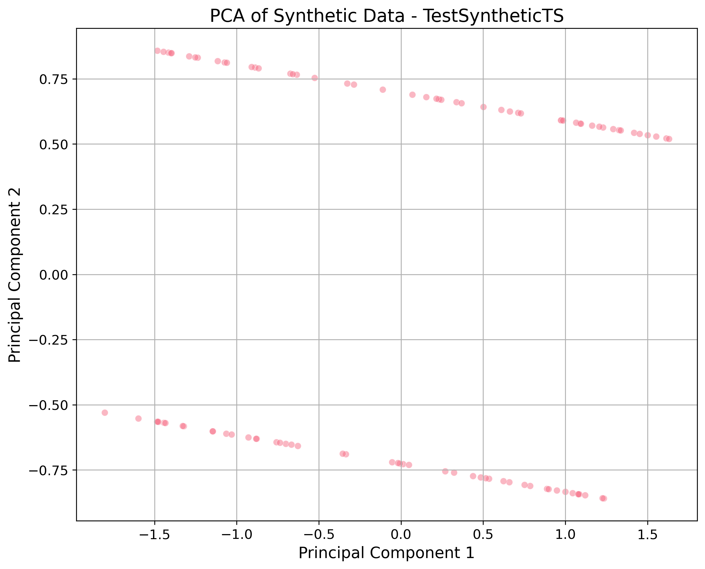

# Synthetic Data Quality Report

**Generator:** TestSyntheticTS
**Date:** 2026-01-15T11:31:16.664143

## 📊 Dataset Information
- **Rows:** 100
- **Columns:** 3
- **Duplicates:** 0 (None %)

## ⭐ Quality Highlights
- **Null Values:** N/A
- **Exact Duplicates:** 0 (0.0%)

## 🔢 Numeric Statistics
| Column | Mean | Median | Mode | Std Dev | Distribution |
| :--- | :--- | :--- | :--- | :--- | :--- |
| Value | 0.0380 | 0.1128 | -1.1588105947447396 | 0.6929 | **uniform (p=0.3303)** |

## 🖼️ Visualizations
### Dimensionality Reduction (PCA)

